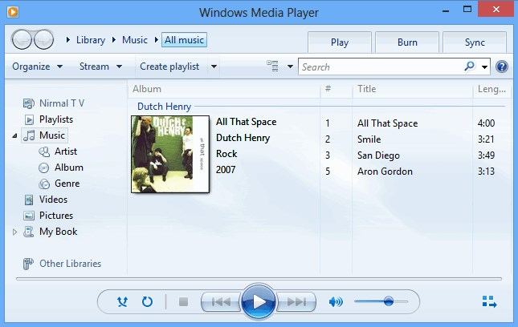

# windows-media-player

## Introduction

### Windows Media Player

[https://github.com/vietphan1995/windows-media-player.git](https://github.com/vietphan1995/windows-media-player.git)

Windows Media Player is a software act as media player that plays video, image, audio views widget, plugin on smart screen devices, especially on television.

Windows Media Player supports browsing on variety media sources, with high quality in low latency.

Windows Media Player concept is playing many granted widgets in one screen that means it support basic widgets like audio, music, image, video. It can play album image with music or mute video with music.

Windows Media Player widget includes clock, watch widget, support language widget like text widget or sign widget, sign widget, color/hue background widget, karaoke widget as Oke widget, room light sensor saving energy widget.

Windows Media Player tries to become default media player application on smart television in long term.

### [back to git projects …](https://github.com/vietphan1995/projects)

### Notes
https://phantrungviet.notion.site/windows-media-player-1c25e832d6ee80a4ac81f290f810338d